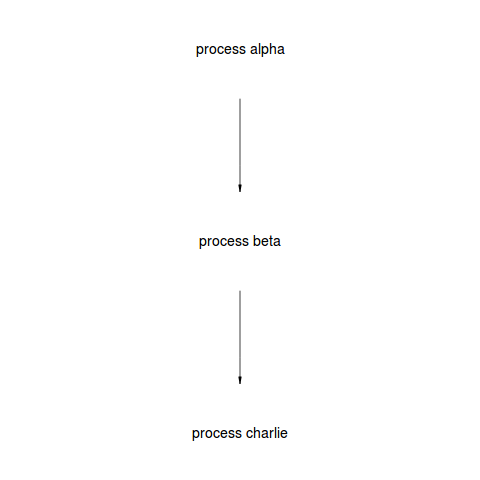

# sake narimasu!

## requirements

you will need:

- [RGraphviz](http://www.bioconductor.org/packages/release/bioc/html/Rgraphviz.html)

- [sake]()

## quickly!

in R:

    source("http://bioconductor.org/biocLite.R")
    biocLite("Rgraphviz")
    install.packages("gridGraphviz")

command prompt:

    pip install master-sake

see:

    cat narimasu.R

## what's this?

simply, 

1. use `sake` to generate dot files for workflows

2. load them in R and use gridGraphviz to plot the dot file and save png, for example:

## why?

because I didn't like the Graphviz look? :) (mostly just for fun.)

## author

Contact [kenny@northpole.sg](mailto:kenny@northpole.sg)
